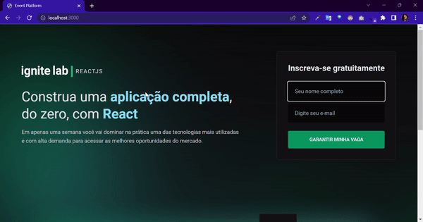
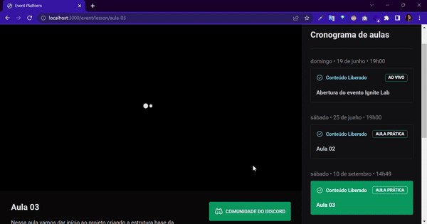

# :hearts: Projeto

Criar a estrutura base da aplicação utilizando ReactJS, Vite e TailwindCSS. Realiza o setup do projeto no GraphCMS criando as entidades da aplicação e integrando a API GraphQL gerada pela plataforma do front-end utilizando Apollo Client.
  

 
  
  
##  :rocket: Demonstração

 

    

 

    

 

##  :computer:  Tecnologias 

- ReactJs 

- Vite 

- TailwindCSS

- GraphQL

- ApolloClient

- Phosphor Icons 

- VimeJS

- GraphCMS 

  

##

Feito por mim com :purple_heart: junto com a Rocketseat :rocket: 

